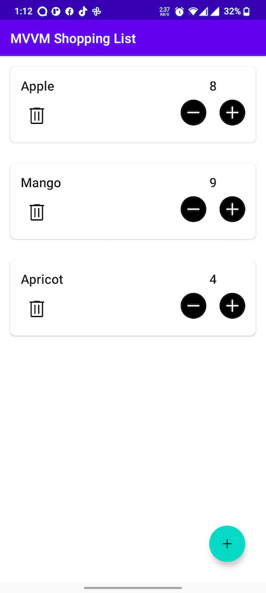

# MVVM-TODO-Android-app

## Intro

Hi, this is just a simple application MVVM based TODO List application, basically a shopping list
application, where you can add Items and their quantity that you want to purchase. You can increase
or decrease the quantity of added items.And when you are done purchasing you can delete the item.

This project was created when I was learning Dependency Injection using Hilt in Android

## Screens

|Home Screen|Add Item|
|---|---|
|||

## Tech Stacks

- ###MVVM
- ###Hilt
- ###ROOM

## About Me

This is Waqas, an indie Android Developer.

[WaqasYounis.com](https://waqasyounis.com)

[Follow me on LinkedIn](https://www.linkedin.com/in/waqas-younis-3587a9119/)

##UPDATE JAN 2023

- Made the UI further beautiful
- Added Swipe to Delete and undo option 
- Optimised RecyclerView performance by using DiffUtils,

